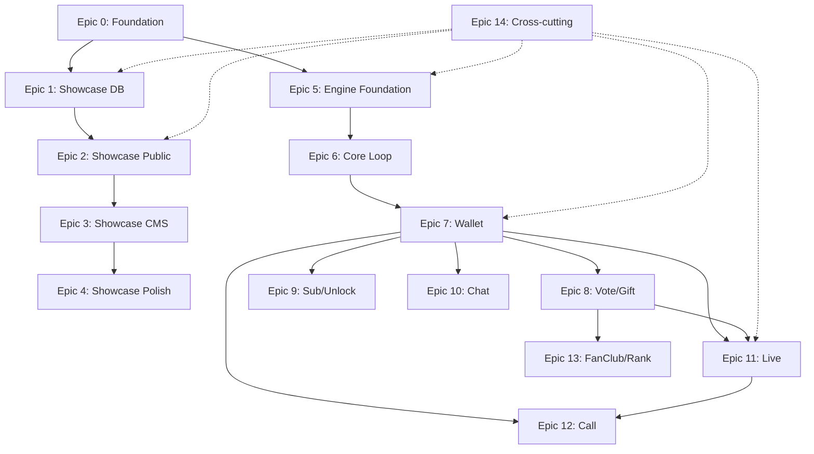

# Mr.FOX — Implementation Plan & Work Breakdown Structure

> **SCOPE:** Showcase + Engine (ทั้งคู่)  
> **ที่มา:** `Mr_FOX_Website_Spec.md` · `Mr_FOX_Engine_Spec.md` · `Mr_FOX_Architecture_Decisions.md`  
> **เรียงลำดับ:** MVP-first (Showcase ก่อน → Engine core loop → monetization → real-time)  
> **Version:** 1.0 · วันที่: 2026-06-17

---

## สรุปภาพรวม (Executive Summary)

| ลำดับ | Phase | โปรดักต์ | เป้าหมาย MVP |
|------|-------|----------|--------------|
| 0 | Foundation | ทั้งคู่ | Design tokens, repo structure, CI baseline |
| 1 | MVP Public | Showcase | เว็บ public + data model + seed Matrix |
| 2 | MVP CMS | Showcase | Admin CRUD + media + analytics |
| 3 | MVP Core | Engine | Auth, Profile, Post, Follow |
| 4 | MVP Money | Engine | Wallet, top-up, Vote, Gift, revenue share |
| 5 | MVP Content $ | Engine | Subscription, Unlock Photo/Video |
| 6 | Real-time I | Engine | Chat (text) |
| 7 | Real-time II | Engine | Live (SFU), Live Archive |
| 8 | Real-time III | Engine | Voice/Video Call |
| 9 | Polish | ทั้งคู่ | Fan Club, Ranking, Moderation, i18n, observability |

**หลักการ:** Showcase *อธิบาย* ecosystem · Engine *คือ* platform — **แยก codebase / deploy กัน** ใช้ร่วมแค่ Brand + Taxonomy + Design tokens

---

## Legend

| สัญลักษณ์ | ความหมาย |
|----------|----------|
| **S** | ≤ 3 วันทำงาน |
| **M** | 4–10 วันทำงาน |
| **L** | > 10 วันทำงาน |
| **P0** | Blocking MVP |
| **P1** | สำคัญหลัง MVP |
| **P2** | Polish / V2 |

### Checklist Tags (ระบุเฉพาะที่เกี่ยวข้องต่อ Task)

`SCAL` scalability · `SEC` security · `PERF` performance · `ARCH` architecture · `SEO` · `BE/FE` backend/frontend · `MOB` mobile · `PAY` payment/wallet · `RT` real-time · `COMP` compliance(PDPA/KYC) · `TEST` testing · `OPS` devops/CI-CD · `I18N` · `OBS` observability

---

# EPIC 0 — Foundation & Shared Design System

| ฟิลด์ | ค่า |
|-------|-----|
| **Phase** | 0 — Foundation |
| **Priority** | P0 |
| **Dependency** | ไม่มี |
| **Effort** | M |
| **Role** | Tech Lead, Design Lead, DevOps |

### Acceptance Criteria (Epic)
- [ ] มี monorepo หรือ multi-repo แยก `showcase/` + `engine/` ชัดเจน พร้อม README
- [ ] `DESIGN.md` + design tokens (color, spacing, radius, typography Prompt) ใช้ร่วมกัน web + Flutter
- [ ] `SKILL.md` (Tailwind discipline, shadcn-first) วางใน repo
- [ ] CI pipeline baseline รัน lint + test ทั้ง 2 โปรดักต์

---

## Task 0.1 — Repository & Project Scaffolding

| Checklist | `ARCH` `OPS` `BE/FE` |
|-----------|----------------------|

### Subtask 0.1.1 — สร้างโครงสร้าง repo แยก Product A/B
- Showcase: Next.js App Router + Tailwind + shadcn/ui
- Engine API: NestJS + module structure
- Engine Mobile: Flutter project
- Engine Admin (optional phase 2): Next.js + shadcn/ui

### Subtask 0.1.2 — ตั้งค่า environment & secrets template
- `.env.example` แยกต่อ service
- ห้าม commit secrets จริง

### Subtask 0.1.3 — Docker Compose สำหรับ local dev
- Postgres (แยก DB หรือ schema แยก)
- Redis (Engine)
- S3-compatible (MinIO local)

---

## Task 0.2 — Design Tokens & UI Standards

| Checklist | `ARCH` `BE/FE` `MOB` `I18N` |
|-----------|----------------------------|

### Subtask 0.2.1 — สร้าง `DESIGN.md` + token file
- Colors, spacing, radius, typography (Prompt — รองรับไทย)
- Export เป็น CSS variables (web) + Dart constants (Flutter)

### Subtask 0.2.2 — Showcase: ติดตั้ง shadcn/ui + Tailwind config จาก tokens
- ห้าม build component จากศูนย์ถ้า shadcn มี
- ใช้ `@apply` สำหรับ class ซ้ำ

### Subtask 0.2.3 — Flutter: สร้าง ThemeData จาก tokens เดียวกัน
- Custom widgets base (Button, Card, Input) สอดคล้อง web

### Subtask 0.2.4 — Animation baseline
- Web: Framer Motion + Lenis
- Flutter: built-in / Lottie สำหรับ gift animation

---

## Task 0.3 — CI/CD Baseline

| Checklist | `OPS` `TEST` `SEC` |
|-----------|-------------------|

### Subtask 0.3.1 — GitHub Actions / CI pipeline
- Lint (ESLint, Dart analyzer)
- Type check
- Unit test gate

### Subtask 0.3.2 — Preview deploy
- Showcase → Vercel preview
- Engine API → Docker staging

### Subtask 0.3.3 — Dependency scanning baseline
- npm audit / Dependabot

---

# EPIC 1 — Showcase: Data Model & Database

| ฟิลด์ | ค่า |
|-------|-----|
| **Phase** | 1 — MVP Public |
| **Priority** | P0 |
| **Dependency** | Epic 0 |
| **Effort** | M |
| **Role** | Backend Dev, Full-stack |

### Acceptance Criteria (Epic)
- [ ] Schema ครบตาม Website Spec §10
- [ ] Seed data: 5 categories, 10 platform types, ~30 features, junction Matrix §5–7
- [ ] Migration รันซ้ำได้ (idempotent seed)
- [ ] Query หน้า Platform Detail generate Features Matrix อัตโนมัติจาก junction

---

## Task 1.1 — PostgreSQL Schema (Showcase)

| Checklist | `SCAL` `ARCH` `BE/FE` `SEC` |
|-----------|------------------------------|

### Subtask 1.1.1 — ตารางหลัก
`platform_categories`, `platform_types`, `features`, `applications`, `download_links`, `screenshots`, `news`, `banners`, `media`, `users`

### Subtask 1.1.2 — Junction tables
`platform_type_features` (status: core/optional/custom/no)  
`platform_type_permissions` (§6)  
`category_revenue` (§7)  
`application_features` (override รายแอป)

### Subtask 1.1.3 — Indexes & constraints
- slug unique ทุก entity
- FK + cascade rules
- index สำหรับ filter/search

### Subtask 1.1.4 — Drizzle ORM setup + migrations

---

## Task 1.2 — Seed Data จาก Matrix

| Checklist | `SCAL` `ARCH` `TEST` |
|-----------|---------------------|

### Subtask 1.2.1 — Seed 5 categories + 10 platform types
### Subtask 1.2.2 — Seed features Group A/B/C (~30 records)
### Subtask 1.2.3 — Seed Features Matrix §5 (junction)
### Subtask 1.2.4 — Seed Permission Matrix §6 + Revenue Matrix §7
### Subtask 1.2.5 — Seed sample applications (FOXY, TOM Thailand, ฯลฯ) + download links

---

## Task 1.3 — Showcase API Layer

| Checklist | `SCAL` `PERF` `SEC` `BE/FE` |
|-----------|----------------------------|

### Subtask 1.3.1 — Route Handlers / API สำหรับ public read
- List/filter: platforms, apps, features, news
- Detail by slug

### Subtask 1.3.2 — Global search endpoint (basic)
- Platform / App / Feature / News

### Subtask 1.3.3 — Download click tracking endpoint
- บันทึก event ต่อ app_id + link type

---

# EPIC 2 — Showcase: Public Website (Phase 1)

| ฟิลด์ | ค่า |
|-------|-----|
| **Phase** | 1 — MVP Public |
| **Priority** | P0 |
| **Dependency** | Epic 1 |
| **Effort** | L |
| **Role** | Frontend Dev, UI/UX |

### Acceptance Criteria (Epic)
- [ ] ทุกหน้า sitemap §8 ใช้งานได้ (ยกเว้น admin)
- [ ] ผู้เข้าชมเข้าใจ ecosystem ภายใน 2–3 นาที
- [ ] ถึงหน้า Download ≤ 3 คลิกจาก Home
- [ ] Lighthouse > 90 (mobile)
- [ ] SEO metadata ทุกหน้า content

---

## Task 2.1 — Global Layout & Components

| Checklist | `BE/FE` `PERF` `SEO` `I18N` |
|-----------|----------------------------|

### Subtask 2.1.1 — Header: Logo, Nav, Search placeholder, Language switcher (disabled/future)
### Subtask 2.1.2 — Footer: About, Contact, Privacy, Terms, Copyright, Social
### Subtask 2.1.3 — Responsive mobile-first layout
### Subtask 2.1.4 — Image optimization (next/image) + lazy loading

---

## Task 2.2 — Home `/`

| Checklist | `BE/FE` `PERF` `SEO` |
|-----------|---------------------|

### Subtask 2.2.1 — Hero Banner (Logo, Tagline, CTA, optional video)
### Subtask 2.2.2 — Ecosystem Overview (5 categories)
### Subtask 2.2.3 — Platform Types Overview (10 cards)
### Subtask 2.2.4 — Featured Applications
### Subtask 2.2.5 — Core Features highlight
### Subtask 2.2.6 — Statistics (dynamic จาก DB)
### Subtask 2.2.7 — Latest News + Footer

---

## Task 2.3 — Platforms `/platforms` + `/platforms/{slug}`

| Checklist | `SCAL` `BE/FE` `SEO` `ARCH` |
|-----------|----------------------------|

### Subtask 2.3.1 — Platform list page
### Subtask 2.3.2 — Platform detail: Hero, Concept, Creator/Visitor model
### Subtask 2.3.3 — **Features Matrix auto-generate** จาก junction §5
### Subtask 2.3.4 — Revenue Model จาก category_revenue §7
### Subtask 2.3.5 — Example Applications + Download section

---

## Task 2.4 — Applications `/apps` + `/apps/{slug}`

| Checklist | `SCAL` `BE/FE` `PERF` `SEO` |
|-----------|----------------------------|

### Subtask 2.4.1 — Card grid + Search + Filter (Category, Platform Type)
### Subtask 2.4.2 — App detail: Hero, About, Features mapping, Screenshots
### Subtask 2.4.3 — Download buttons (iOS/Android/APK/Web) + tracking
### Subtask 2.4.4 — Related Applications

---

## Task 2.5 — Features `/features` + `/features/{slug}`

| Checklist | `BE/FE` `SEO` |
|-----------|--------------|

### Subtask 2.5.1 — Grid แสดง **Group B เท่านั้น**
### Subtask 2.5.2 — Feature detail: Workflow, Screenshots, Revenue model, Used By apps

---

## Task 2.6 — News, About, Contact

| Checklist | `BE/FE` `SEO` `SEC` `COMP` |
|-----------|---------------------------|

### Subtask 2.6.1 — News list (search/filter/pagination) + detail
### Subtask 2.6.2 — About: Vision, Mission, Ecosystem diagram, Roadmap
### Subtask 2.6.3 — Contact form (Name/Email/Subject/Message) + rate limit + honeypot
### Subtask 2.6.4 — Business/Partnership inquiry types

---

## Task 2.7 — SEO & Performance

| Checklist | `SEO` `PERF` `OPS` |
|-----------|-------------------|

### Subtask 2.7.1 — Metadata API: title, description, OG image, canonical
### Subtask 2.7.2 — `sitemap.xml` generate อัตโนมัติ
### Subtask 2.7.3 — `robots.txt`
### Subtask 2.7.4 — Lighthouse audit + fix จน > 90

---

# EPIC 3 — Showcase: CMS / Back Office (Phase 2)

| ฟิลด์ | ค่า |
|-------|-----|
| **Phase** | 2 — CMS |
| **Priority** | P1 |
| **Dependency** | Epic 2 |
| **Effort** | L |
| **Role** | Full-stack, Backend Dev |

### Acceptance Criteria (Epic)
- [ ] Admin login (JWT) + RBAC (Admin / Editor)
- [ ] CRUD ทุก module §9
- [ ] Media Library upload ไป S3 + CDN
- [ ] Analytics dashboard พื้นฐาน
- [ ] Audit log การแก้ไข content

---

## Task 3.1 — Auth & RBAC (CMS)

| Checklist | `SEC` `BE/FE` `COMP` |
|-----------|---------------------|

### Subtask 3.1.1 — User table + roles (Admin, Editor)
### Subtask 3.1.2 — JWT auth + refresh + httpOnly cookie
### Subtask 3.1.3 — CSRF protection
### Subtask 3.1.4 — Rate limiting login
### Subtask 3.1.5 — `/admin` route protection middleware

---

## Task 3.2 — Admin Dashboard & CRUD Modules

| Checklist | `BE/FE` `SCAL` `SEC` |
|-----------|---------------------|

### Subtask 3.2.1 — Dashboard statistics รวม
### Subtask 3.2.2 — Platform Management CRUD (+ feature toggles per type)
### Subtask 3.2.3 — Application Management CRUD (+ screenshots, download links)
### Subtask 3.2.4 — Feature Management CRUD
### Subtask 3.2.5 — News Management CRUD (draft/publish)
### Subtask 3.2.6 — Banner Management CRUD
### Subtask 3.2.7 — Download Management
### Subtask 3.2.8 — User Management (Admin only)

---

## Task 3.3 — Media Library

| Checklist | `SCAL` `SEC` `OPS` `PERF` |
|-----------|--------------------------|

### Subtask 3.3.1 — S3-compatible upload (poster/logo/screenshot/video)
### Subtask 3.3.2 — Cloudflare CDN integration
### Subtask 3.3.3 — Image resize/optimize on upload
### Subtask 3.3.4 — File type + size validation

---

## Task 3.4 — Analytics Dashboard

| Checklist | `OBS` `BE/FE` `PERF` |
|-----------|---------------------|

### Subtask 3.4.1 — Track: visitors, page views, downloads
### Subtask 3.4.2 — Top Apps / Platforms / Features (Recharts)
### Subtask 3.4.3 — Download count ต่อแอป

---

## Task 3.5 — CMS Security & Compliance

| Checklist | `SEC` `COMP` `OBS` |
|-----------|-------------------|

### Subtask 3.5.1 — Audit log (who/when/what)
### Subtask 3.5.2 — HTTPS enforcement
### Subtask 3.5.3 — Privacy Policy / Terms pages (public)
### Subtask 3.5.4 — PDPA: cookie consent banner (ถ้ามี analytics 3rd party)

---

# EPIC 4 — Showcase: Polish (Phase 3)

| ฟิลด์ | ค่า |
|-------|-----|
| **Phase** | 3 — Polish |
| **Priority** | P2 |
| **Dependency** | Epic 3 |
| **Effort** | M |
| **Role** | Frontend Dev |

### Acceptance Criteria (Epic)
- [ ] i18n th/en/zh ครบหน้า public หลัก
- [ ] Global Search ขั้นสูง (fuzzy, highlight)
- [ ] พร้อม scale 100+ apps โดยไม่แก้ architecture

---

## Task 4.1 — Internationalization

| Checklist | `I18N` `SEO` `ARCH` |
|-----------|--------------------|

### Subtask 4.1.1 — next-intl หรือเทียบเท่า + route `/th` `/en` `/zh`
### Subtask 4.1.2 — แปล UI strings + content fallback
### Subtask 4.1.3 — hreflang tags

---

## Task 4.2 — Advanced Global Search

| Checklist | `PERF` `SCAL` `BE/FE` |
|-----------|----------------------|

### Subtask 4.2.1 — Full-text search (Postgres tsvector หรือ Meilisearch)
### Subtask 4.2.2 — Unified search UI (Platform/App/Feature/News)
### Subtask 4.2.3 — Keyboard shortcut + instant results

---

# EPIC 5 — Engine: Foundation & Infrastructure

| ฟิลด์ | ค่า |
|-------|-----|
| **Phase** | 3 — Engine MVP Core |
| **Priority** | P0 |
| **Dependency** | Epic 0 (แนะนำ Showcase Epic 1 เสร็จก่อนเพื่อ share taxonomy) |
| **Effort** | L |
| **Role** | Backend Dev, DevOps, Mobile Dev |

### Acceptance Criteria (Epic)
- [ ] NestJS API รันบน Docker + Postgres + Redis
- [ ] Flutter app เชื่อม API ได้
- [ ] Auth Creator/Visitor (JWT + refresh)
- [ ] Platform type template (เริ่ม Creator Specific = FOXY)

---

## Task 5.1 — Engine Database Schema

| Checklist | `SCAL` `ARCH` `SEC` `BE/FE` |
|-----------|------------------------------|

### Subtask 5.1.1 — Identity: `users`, `creator_profiles`, `creator_settings`
### Subtask 5.1.2 — Content: `posts`, `media`, `follows`
### Subtask 5.1.3 — Platform config: `platform_instances`, `feature_flags` (จาก Matrix template)
### Subtask 5.1.4 — Ops: `notifications`, `reports`, `moderation_logs`
### Subtask 5.1.5 — Migrations (TypeORM/Prisma)

---

## Task 5.2 — NestJS API Scaffold

| Checklist | `ARCH` `SEC` `OPS` `OBS` |
|-----------|-------------------------|

### Subtask 5.2.1 — Module structure: auth, users, posts, wallet, ...
### Subtask 5.2.2 — Global validation pipe, exception filter
### Subtask 5.2.3 — Redis connection (session, rate limit)
### Subtask 5.2.4 — S3 media upload service
### Subtask 5.2.5 — Health check + structured logging

---

## Task 5.3 — Auth (Creator / Visitor)

| Checklist | `SEC` `COMP` `BE/FE` `MOB` |
|-----------|---------------------------|

### Subtask 5.3.1 — Register / Login (email + phone)
### Subtask 5.3.2 — JWT access + refresh token rotation
### Subtask 5.3.3 — Role guard (creator/visitor/admin)
### Subtask 5.3.4 — PDPA: consent checkbox, privacy policy link
### Subtask 5.3.5 — Flutter: secure token storage

---

## Task 5.4 — Flutter App Foundation

| Checklist | `MOB` `ARCH` `PERF` `BE/FE` |
|-----------|----------------------------|

### Subtask 5.4.1 — Project structure (feature-first)
### Subtask 5.4.2 — API client + auth interceptor
### Subtask 5.4.3 — Navigation (Creator vs Visitor flows)
### Subtask 5.4.4 — Theme จาก shared design tokens
### Subtask 5.4.5 — Push notification setup (FCM/APNs) — skeleton

---

# EPIC 6 — Engine: Core Loop (Profile → Post → Follow)

| ฟิลด์ | ค่า |
|-------|-----|
| **Phase** | 3 — Engine MVP Core |
| **Priority** | P0 |
| **Dependency** | Epic 5 |
| **Effort** | L |
| **Role** | Backend Dev, Mobile Dev |

### Acceptance Criteria (Epic)
- [ ] Creator สร้าง/แก้/ลบ/pin post ได้ (photo, video, text, album)
- [ ] Visitor like, comment, share, save, report ได้
- [ ] Follow/unfollow + notification new post
- [ ] Creator profile + settings (ราคาบริการ — เก็บค่า ยังไม่ charge)

---

## Task 6.1 — Profile Module

| Checklist | `BE/FE` `MOB` `SEC` `SCAL` |
|-----------|---------------------------|

### Subtask 6.1.1 — Creator profile CRUD (image, cover, bio, category, social)
### Subtask 6.1.2 — Statistics aggregation (followers, posts, votes placeholder)
### Subtask 6.1.3 — Creator settings (chat/voice/video/sub prices)
### Subtask 6.1.4 — Flutter: profile screens

---

## Task 6.2 — Post Module

| Checklist | `SCAL` `PERF` `BE/FE` `MOB` `SEC` |
|-----------|----------------------------------|

### Subtask 6.2.1 — Create post (photo/video/text/album) + media upload S3
### Subtask 6.2.2 — Feed API (pagination, cursor-based)
### Subtask 6.2.3 — Like, Comment, Share, Save, Report
### Subtask 6.2.4 — Pin / Edit / Delete (creator only)
### Subtask 6.2.5 — Flutter: feed + post detail + create post UI
### Subtask 6.2.6 — Content moderation flag (report queue)

---

## Task 6.3 — Follow Module

| Checklist | `SCAL` `BE/FE` `MOB` `RT` |
|-----------|--------------------------|

### Subtask 6.3.1 — Follow / Unfollow API
### Subtask 6.3.2 — Followers / Following list
### Subtask 6.3.3 — Notification: new post, new live (skeleton)

---

## Task 6.4 — Search (Basic)

| Checklist | `PERF` `SCAL` `BE/FE` `MOB` |
|-----------|----------------------------|

### Subtask 6.4.1 — Search creator, category, post, hashtag
### Subtask 6.4.2 — Postgres full-text หรือ dedicated search index

---

# EPIC 7 — Engine: Wallet & Payment

| ฟิลด์ | ค่า |
|-------|-----|
| **Phase** | 4 — Engine MVP Money |
| **Priority** | P0 |
| **Dependency** | Epic 6 |
| **Effort** | L |
| **Role** | Backend Dev, Mobile Dev, Payment Integration |

### Acceptance Criteria (Epic)
- [ ] Visitor เติมเงินเข้า wallet ผ่าน gateway อย่างน้อย 1 ช่องทาง (KKP หรือ Pay Solutions)
- [ ] Transaction history ครบถ้วน (immutable ledger)
- [ ] Apple Pay / Google Pay บน mobile (phase 4b)
- [ ] Revenue share อ่านจาก `revenue_shares` config

---

## Task 7.1 — Wallet Core

| Checklist | `PAY` `SEC` `SCAL` `ARCH` `COMP` |
|-----------|----------------------------------|

### Subtask 7.1.1 — `wallets` + `wallet_transactions` (topup/spend/earn/withdraw)
### Subtask 7.1.2 — Double-entry / balance consistency checks
### Subtask 7.1.3 — Idempotency keys สำหรับ payment callbacks
### Subtask 7.1.4 — Flutter: wallet UI + transaction history

---

## Task 7.2 — Payment Gateway Integration

| Checklist | `PAY` `SEC` `COMP` `TEST` `OPS` |
|-----------|--------------------------------|

### Subtask 7.2.1 — KKP integration (Card / QR PromptPay)
### Subtask 7.2.2 — Pay Solutions (backup PG)
### Subtask 7.2.3 — Webhook handler + signature verification
### Subtask 7.2.4 — Apple Pay (iOS) + Google Pay (Android)
### Subtask 7.2.5 — Sandbox + production environment separation

---

## Task 7.3 — Revenue Share Engine

| Checklist | `PAY` `ARCH` `SCAL` `BE/FE` |
|-----------|----------------------------|

### Subtask 7.3.1 — `revenue_shares` table (per feature, per creator/deal)
### Subtask 7.3.2 — Split logic: platform_pct + creator_pct at transaction time
### Subtask 7.3.3 — Admin API ปรับ share โดยไม่ deploy ใหม่

---

## Task 7.4 — Creator Payout & KYC

| Checklist | `PAY` `COMP` `SEC` `TEST` |
|-----------|--------------------------|

### Subtask 7.4.1 — `payouts` table + request flow
### Subtask 7.4.2 — KYC status (`kyc_status` on users) — gate ก่อนถอน
### Subtask 7.4.3 — PDPA: เก็บข้อมูล KYC แยก encrypt at rest
### Subtask 7.4.4 — Payout approval workflow (admin)

---

# EPIC 8 — Engine: Monetization — Vote & Gift

| ฟิลด์ | ค่า |
|-------|-----|
| **Phase** | 4 — Engine MVP Money |
| **Priority** | P0 |
| **Dependency** | Epic 7 |
| **Effort** | M |
| **Role** | Backend Dev, Mobile Dev |

### Acceptance Criteria (Epic)
- [ ] Visitor vote ด้วย wallet (10/20/50/100 บาท)
- [ ] Visitor ส่ง gift sticker (animated) ด้วย wallet
- [ ] Creator ดู vote count, gift history, top supporters
- [ ] เงินแบ่งตาม revenue_shares อัตโนมัติ

---

## Task 8.1 — Vote Module

| Checklist | `PAY` `SCAL` `BE/FE` `MOB` `TEST` |
|-----------|------------------------------------|

### Subtask 8.1.1 — Vote API (deduct wallet → credit creator)
### Subtask 8.1.2 — Vote tiers (10/20/50/100)
### Subtask 8.1.3 — Creator dashboard: votes per post
### Subtask 8.1.4 — Flutter: vote UI on post

---

## Task 8.2 — Gift Module

| Checklist | `PAY` `PERF` `MOB` `BE/FE` `RT` |
|-----------|-------------------------------|

### Subtask 8.2.1 — `gift_stickers` catalog (Rose, Coffee, Crown, ...)
### Subtask 8.2.2 — Send gift API + wallet deduct
### Subtask 8.2.3 — Gift history + top supporters
### Subtask 8.2.4 — Flutter: sticker picker + Lottie/Rive animation overlay

---

# EPIC 9 — Engine: Subscription & Unlock Content

| ฟิลด์ | ค่า |
|-------|-----|
| **Phase** | 5 — Engine Content $ |
| **Priority** | P1 |
| **Dependency** | Epic 7 |
| **Effort** | M |
| **Role** | Backend Dev, Mobile Dev |

### Acceptance Criteria (Epic)
- [ ] Creator สร้าง premium feed + ตั้งราคา (monthly/quarterly/yearly)
- [ ] Visitor subscribe → เข้าถึง content พิเศษ
- [ ] Unlock photo (blur) / unlock video (preview) ทำงานครบ
- [ ] Subscription auto-expire + renewal

---

## Task 9.1 — Subscription Module

| Checklist | `PAY` `SCAL` `BE/FE` `MOB` `TEST` |
|-----------|------------------------------------|

### Subtask 9.1.1 — `subscriptions` CRUD + expiry logic
### Subtask 9.1.2 — Premium feed filter (subscriber-only posts)
### Subtask 9.1.3 — Recurring billing จาก wallet balance
### Subtask 9.1.4 — Flutter: subscribe flow + premium badge

---

## Task 9.2 — Unlock Photo / Video

| Checklist | `PAY` `SEC` `PERF` `MOB` `BE/FE` |
|-----------|---------------------------------|

### Subtask 9.2.1 — Upload with blur generation (image processing)
### Subtask 9.2.2 — Video preview clip generation
### Subtask 9.2.3 — `unlocks` table + access control
### Subtask 9.2.4 — Signed URL สำหรับ media ที่ปลดล็อกแล้ว (time-limited)
### Subtask 9.2.5 — Flutter: blur overlay + unlock CTA

---

# EPIC 10 — Engine: Chat (Real-time Text)

| ฟิลด์ | ค่า |
|-------|-----|
| **Phase** | 6 — Real-time I |
| **Priority** | P1 |
| **Dependency** | Epic 7 |
| **Effort** | M |
| **Role** | Backend Dev, Mobile Dev |

### Acceptance Criteria (Epic)
- [ ] Creator ตั้งราคาต่อข้อความ
- [ ] Visitor จ่ายก่อนส่ง
- [ ] Real-time delivery (WebSocket)
- [ ] Read status + message history
- [ ] Gift in chat (optional subtask)

---

## Task 10.1 — Chat Backend

| Checklist | `RT` `PAY` `SEC` `SCAL` `BE/FE` |
|-----------|--------------------------------|

### Subtask 10.1.1 — `chats` + `chat_messages` schema
### Subtask 10.1.2 — Pay-per-message flow (wallet hold → release)
### Subtask 10.1.3 — WebSocket gateway (NestJS)
### Subtask 10.1.4 — Read receipts
### Subtask 10.1.5 — Priority message queue

---

## Task 10.2 — Chat Flutter UI

| Checklist | `RT` `MOB` `PERF` `BE/FE` |
|-----------|---------------------------|

### Subtask 10.2.1 — Chat list + thread UI
### Subtask 10.2.2 — Real-time message stream
### Subtask 10.2.3 — Payment confirmation before send
### Subtask 10.2.4 — Gift in chat animation

---

# EPIC 11 — Engine: Live & Live Archive

| ฟิลด์ | ค่า |
|-------|-----|
| **Phase** | 7 — Real-time II |
| **Priority** | P1 |
| **Dependency** | Epic 7, Epic 8 |
| **Effort** | L |
| **Role** | Backend Dev, DevOps, Mobile Dev |

### Acceptance Criteria (Epic)
- [ ] Live room types: Free / Paid / Password / Paid+Password
- [ ] Broadcast ผ่าน SFU (LiveKit) รองรับ 1-to-many
- [ ] Visitor: comment, gift, vote ระหว่าง live
- [ ] Moderation: kick, mute, ban
- [ ] Live archive: save, publish, ขายย้อนหลัง

---

## Task 11.1 — SFU Infrastructure

| Checklist | `RT` `OPS` `SEC` `PERF` `OBS` |
|-----------|------------------------------|

### Subtask 11.1.1 — LiveKit (หรือ SFU ที่มี) deploy + TURN (coturn)
### Subtask 11.1.2 — Room token generation (NestJS)
### Subtask 11.1.3 — Bandwidth/cost monitoring baseline
### Subtask 11.1.4 — Recording pipeline สำหรับ archive

---

## Task 11.2 — Live Room Module

| Checklist | `RT` `PAY` `SEC` `MOB` `BE/FE` |
|-----------|-------------------------------|

### Subtask 11.2.1 — `live_rooms` CRUD + room types
### Subtask 11.2.2 — Paid entry (wallet deduct)
### Subtask 11.2.3 — Password-protected rooms
### Subtask 11.2.4 — `live_events` real-time log (comment/gift/vote)
### Subtask 11.2.5 — Moderation actions (kick/mute/ban)

---

## Task 11.3 — Live Flutter Client

| Checklist | `RT` `MOB` `PERF` `PAY` |
|-----------|------------------------|

### Subtask 11.3.1 — Broadcaster UI (creator)
### Subtask 11.3.2 — Viewer UI (visitor) + gift/vote overlay
### Subtask 11.3.3 — LiveKit Flutter SDK integration
### Subtask 11.3.4 — Reconnection / network degradation handling

---

## Task 11.4 — Live Archive

| Checklist | `PAY` `PERF` `BE/FE` `MOB` `SCAL` |
|-----------|----------------------------------|

### Subtask 11.4.1 — `live_archives` save from recording
### Subtask 11.4.2 — Publish + set price
### Subtask 11.4.3 — Visitor purchase to watch
### Subtask 11.4.4 — VOD playback + CDN delivery

---

# EPIC 12 — Engine: Voice & Video Call

| ฟิลด์ | ค่า |
|-------|-----|
| **Phase** | 8 — Real-time III |
| **Priority** | P1 |
| **Dependency** | Epic 7, Epic 11 (share WebRTC infra) |
| **Effort** | L |
| **Role** | Backend Dev, Mobile Dev |

### Acceptance Criteria (Epic)
- [ ] Creator ตั้งราคาต่อนาที (voice + video)
- [ ] Visitor ซื้อเวลา → เริ่ม call
- [ ] 1:1 WebRTC (P2P + TURN fallback)
- [ ] Video call: gift during call
- [ ] Booking, call history, rating

---

## Task 12.1 — Call Backend

| Checklist | `RT` `PAY` `SEC` `BE/FE` `TEST` |
|-----------|----------------------------------|

### Subtask 12.1.1 — `calls` table (voice/video, duration, status)
### Subtask 12.1.2 — Per-minute billing (wallet deduct timer)
### Subtask 12.1.3 — Booking / scheduling
### Subtask 12.1.4 — Signaling server (WebSocket)
### Subtask 12.1.5 — Call history + rating

---

## Task 12.2 — Call Flutter Client

| Checklist | `RT` `MOB` `PERF` `PAY` |
|-----------|------------------------|

### Subtask 12.2.1 — Voice call UI
### Subtask 12.2.2 — Video call UI + camera switch
### Subtask 12.2.3 — Gift overlay during video call
### Subtask 12.2.4 — WebRTC peer connection + TURN config

---

# EPIC 13 — Engine: Fan Club, Ranking & Moderation

| ฟิลด์ | ค่า |
|-------|-----|
| **Phase** | 9 — Polish |
| **Priority** | P2 |
| **Dependency** | Epic 8 |
| **Effort** | M |
| **Role** | Backend Dev, Mobile Dev |

### Acceptance Criteria (Epic)
- [ ] Fan club tiers (Bronze → Diamond) + benefits
- [ ] Creator ranking real-time (Redis sorted set)
- [ ] Report → Admin moderation workflow
- [ ] Audit log ครบ

---

## Task 13.1 — Fan Club

| Checklist | `PAY` `SCAL` `MOB` `BE/FE` |
|-----------|---------------------------|

### Subtask 13.1.1 — `fan_clubs` tiers + upgrade logic
### Subtask 13.1.2 — Benefits: badge, exclusive content, priority chat/live
### Subtask 13.1.3 — Flutter: fan club UI

---

## Task 13.2 — Ranking (Redis)

| Checklist | `RT` `SCAL` `PERF` `BE/FE` `MOB` |
|-----------|---------------------------------|

### Subtask 13.2.1 — Redis sorted sets: daily/weekly/monthly/all-time
### Subtask 13.2.2 — Score factors: vote, gift, followers, subscribers
### Subtask 13.2.3 — Leaderboard API + Flutter UI

---

## Task 13.3 — Reporting & Moderation

| Checklist | `SEC` `COMP` `OBS` `BE/FE` `MOB` |
|-----------|--------------------------------|

### Subtask 13.3.1 — Report creator/post/comment
### Subtask 13.3.2 — Admin: suspend, remove content, ban user
### Subtask 13.3.3 — `moderation_logs` + audit trail
### Subtask 13.3.4 — Engine Admin web (Next.js): moderation dashboard

---

# EPIC 14 — Cross-cutting: Testing, Observability & Compliance

| ฟิลด์ | ค่า |
|-------|-----|
| **Phase** | ตลอดทุก Phase |
| **Priority** | P0 (baseline) → P1 (เต็มรูป) |
| **Dependency** | ทุก Epic |
| **Effort** | M (ต่อเนื่อง) |
| **Role** | QA, DevOps, Backend Dev |

### Acceptance Criteria (Epic)
- [ ] Unit + integration test coverage หลัก (wallet, auth, payment)
- [ ] E2E smoke test Showcase + Engine critical paths
- [ ] Structured logging + error tracking (Sentry หรือเทียบเท่า)
- [ ] PDPA compliance checklist ผ่านก่อน production

---

## Task 14.1 — Testing Strategy

| Checklist | `TEST` `SEC` `PAY` |
|-----------|-------------------|

### Subtask 14.1.1 — Showcase: Playwright E2E (home → download ≤ 3 clicks)
### Subtask 14.1.2 — Engine API: integration tests (wallet, vote, payment webhook)
### Subtask 14.1.3 — Flutter: widget tests + integration tests (auth, post, wallet)
### Subtask 14.1.4 — Load test: feed API, ranking, live room join

---

## Task 14.2 — Observability

| Checklist | `OBS` `OPS` `PERF` `SEC` |
|-----------|-------------------------|

### Subtask 14.2.1 — Structured JSON logging
### Subtask 14.2.2 — APM / error tracking (Sentry)
### Subtask 14.2.3 — Metrics: API latency, payment success rate, live concurrent users
### Subtask 14.2.4 — Alerting: payment failure spike, SFU downtime

---

## Task 14.3 — Compliance (PDPA / KYC)

| Checklist | `COMP` `SEC` `PAY` |
|-----------|-------------------|

### Subtask 14.3.1 — PDPA: privacy policy, consent, data export/delete request
### Subtask 14.3.2 — KYC flow ก่อน creator payout
### Subtask 14.3.3 — Data retention policy
### Subtask 14.3.4 — PCI: ไม่เก็บ card data โดยตรง (ใช้ PG tokenization)

---

## Task 14.4 — Production DevOps

| Checklist | `OPS` `SEC` `SCAL` |
|-----------|-------------------|

### Subtask 14.4.1 — Showcase: Vercel prod + Cloudflare CDN
### Subtask 14.4.2 — Engine: Docker on VPS/Cloud + Cloudflare
### Subtask 14.4.3 — DB backup + restore drill
### Subtask 14.4.4 — Blue/green หรือ rolling deploy สำหรับ Engine API
### Subtask 14.4.5 — Secrets management (Vault / cloud secrets)

---

# ตารางสรุป Epic (MVP-first)

| ลำดับ | Epic | Phase | Priority | Dep | Effort | Role หลัก | โปรดักต์ |
|------|------|-------|----------|-----|--------|-----------|----------|
| 0 | Foundation & Design System | 0 | P0 | — | M | Tech Lead, Design | ทั้งคู่ |
| 1 | Showcase Data Model | 1 | P0 | 0 | M | Backend | Showcase |
| 2 | Showcase Public Site | 1 | P0 | 1 | L | Frontend | Showcase |
| 3 | Showcase CMS | 2 | P1 | 2 | L | Full-stack | Showcase |
| 4 | Showcase Polish (i18n) | 3 | P2 | 3 | M | Frontend | Showcase |
| 5 | Engine Foundation | 3 | P0 | 0 | L | Backend, Mobile, DevOps | Engine |
| 6 | Engine Core Loop | 3 | P0 | 5 | L | Backend, Mobile | Engine |
| 7 | Wallet & Payment | 4 | P0 | 6 | L | Backend, Payment | Engine |
| 8 | Vote & Gift | 4 | P0 | 7 | M | Backend, Mobile | Engine |
| 9 | Subscription & Unlock | 5 | P1 | 7 | M | Backend, Mobile | Engine |
| 10 | Chat | 6 | P1 | 7 | M | Backend, Mobile | Engine |
| 11 | Live & Archive | 7 | P1 | 7,8 | L | Backend, DevOps, Mobile | Engine |
| 12 | Voice/Video Call | 8 | P1 | 7,11 | L | Backend, Mobile | Engine |
| 13 | Fan Club, Ranking, Mod | 9 | P2 | 8 | M | Backend, Mobile | Engine |
| 14 | Testing, OBS, Compliance | ตลอด | P0→P1 | ทุก | M | QA, DevOps | ทั้งคู่ |

---

# Dependency Graph (ย่อ)

---

# ข้อจำกัดที่ยึดตามสเปก (Constraints Checklist)

| Constraint | Epic ที่เกี่ยวข้อง | วิธีตรวจ |
|------------|------------------|----------|
| Showcase: Next.js + Postgres + shadcn/ui | 1–4 | Code review, stack lock |
| Engine: NestJS + Postgres + Redis + WebRTC(SFU) + Flutter | 5–13 | Architecture review |
| Design tokens ร่วม | 0, 2, 5, 6 | DESIGN.md parity web/Flutter |
| Tailwind class discipline | 0, 2, 3, 13 (admin) | SKILL.md lint |
| แยก codebase Showcase / Engine | 0 | Repo structure |
| Showcase ไม่มี transactional | 2, 3 | ไม่มี wallet/payment ใน Showcase |
| Revenue share = config ไม่ fix ในโค้ด | 7 | `revenue_shares` table |
| Data-driven 100+ apps | 1, 2 | เพิ่ม app = insert row only |
| Matrix generate อัตโนมัติ | 1, 2.3 | Platform detail จาก junction |

---

# Open Items (จาก Architecture Decisions §8)

| # | หัวข้อ | สถานะ | ผลกระทบต่อ WBS |
|---|--------|-------|----------------|
| 1 | Engine Frontend = Flutter? | แนะนำ Flutter (locked ใน WBS นี้) | Epic 5.4, ทุก Flutter task |
| 2 | Community Gift = Optional | Resolved ✅ | Seed permission matrix |
| 3 | SFU vendor | มี SFU แล้ว ✅ | Epic 11 ใช้ LiveKit/ที่มี |

---

# ประมาณการ Effort รวม (คร่าวๆ)

| โปรดักต์ | Epics | Effort รวมโดยประมาณ |
|----------|-------|---------------------|
| **Showcase MVP** (Epic 0–2) | 0, 1, 2 | ~2–3 เดือน (ทีม 2–3 คน) |
| **Showcase เต็ม** (+ Epic 3–4) | +3, +4 | +1–2 เดือน |
| **Engine MVP** (Epic 5–8) | 5–8 | ~3–4 เดือน (ทีม 3–4 คน) |
| **Engine Real-time** (Epic 9–12) | 9–12 | +2–3 เดือน |
| **Polish** (Epic 13–14) | 13–14 | +1 เดือน (ขนานได้) |

> *ตัวเลขเป็นคร่าวๆ สำหรับ planning — ปรับตามขนาดทีมจริง*

---

*เอกสารนี้สร้างจาก Website Spec v2.0 · Engine Spec v1.0 · Architecture Decisions v1.0*
